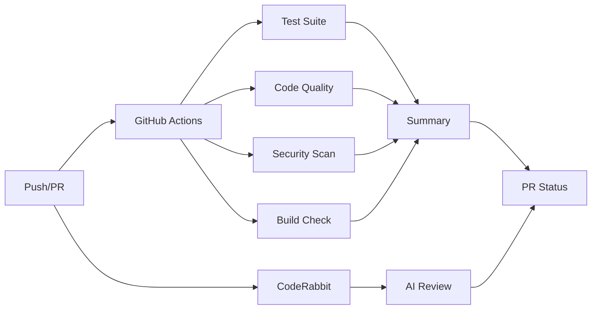

# CI/CD Pipeline Overview

This document provides a comprehensive overview of the RAG Lab CI/CD implementation.

## 🎯 Objectives

The CI/CD pipeline ensures code quality, security, and reliability through:
- Automated testing with coverage requirements
- Code quality checks (linting, formatting, type checking)
- Security vulnerability scanning
- Build verification
- Integration with CodeRabbit AI reviews

## 🏗️ Architecture

### Pipeline Components



### Parallel Execution
All jobs run in parallel for faster feedback:
- **Test Suite**: ~5-10 minutes
- **Code Quality**: ~2-3 minutes
- **Security Scan**: ~2-3 minutes
- **Build Verification**: ~1-2 minutes

## 📋 Configuration Files

| File | Purpose |
|------|---------|
| `.github/workflows/ci.yml` | Main CI/CD workflow definition |
| `pyproject.toml` | Python dependencies including dev tools |
| `ruff.toml` | Linting and formatting rules |
| `mypy.ini` | Type checking configuration |
| `pytest.ini` | Test runner configuration |
| `.bandit` | Security scanning rules |
| `.pre-commit-config.yaml` | Local pre-commit hooks |
| `.coderabbit.yaml` | AI code review configuration |

## 🚀 Features

### 1. Test Automation
- Runs all tests in `src/pipeline_v3/tests/`
- Generates coverage reports (XML, HTML, JSON)
- Enforces minimum 70% coverage
- Uploads test artifacts for debugging

### 2. Code Quality
- **Ruff**: Modern Python linter and formatter
- **MyPy**: Static type checking
- **Format Check**: Ensures consistent code style

### 3. Security Scanning
- **pip-audit**: Checks dependencies for known vulnerabilities
- **bandit**: Scans code for security issues
- **Custom Tests**: SQL injection protection tests

### 4. PR Integration
- Automated comments with results
- Status checks block merge on failure
- Works alongside CodeRabbit reviews
- Artifacts available for download

## 🔧 Usage

### For Developers

1. **Before committing:**
   ```bash
   # Install pre-commit hooks (one time)
   uv run pre-commit install

   # Run all checks manually
   uv run pre-commit run --all-files
   ```

2. **Creating a PR:**
   - Push your branch
   - Create PR
   - Wait for all checks to complete
   - Address any failures or feedback

3. **Debugging failures:**
   - Click on the failed check in the PR
   - View detailed logs
   - Download artifacts if needed
   - Run the same command locally

### For Maintainers

1. **Setup required:**
   - Configure branch protection (see BRANCH_PROTECTION.md)
   - Add required secrets (see SETUP_SECRETS.md)
   - Ensure CodeRabbit is enabled

2. **Monitoring:**
   - Check Actions tab for pipeline health
   - Review security alerts
   - Monitor test coverage trends

## 📊 Reports and Artifacts

Each CI run produces:
- **Test Report**: HTML report with detailed results
- **Coverage Report**: HTML coverage with line-by-line analysis
- **Test Results JSON**: Machine-readable test data
- **Security Reports**: Vulnerability findings

Access via Actions tab → Select workflow run → Artifacts section

## 🔄 Integration with CodeRabbit

The pipeline works seamlessly with CodeRabbit:

| Aspect | CI/CD Pipeline | CodeRabbit |
|--------|----------------|------------|
| **Focus** | Objective metrics | Code quality & design |
| **Timing** | Immediate (~10 min) | Quick (~2-5 min) |
| **Blocking** | Yes - prevents merge | No - advisory only |
| **Feedback** | Pass/fail + metrics | Suggestions & improvements |

## 🛠️ Maintenance

### Adding New Checks
1. Update `.github/workflows/ci.yml`
2. Add new job or step
3. Update branch protection rules
4. Document in this file

### Updating Dependencies
```bash
# Update all dev dependencies
uv sync --all-extras --dev

# Update pre-commit hooks
uv run pre-commit autoupdate
```

### Performance Optimization
- Dependencies are cached between runs
- Jobs run in parallel
- Use `[skip ci]` for docs-only changes

## 📈 Success Metrics

The pipeline helps maintain:
- **Test Coverage**: ≥70% required
- **Type Safety**: No mypy errors
- **Code Quality**: No linting issues
- **Security**: No high-severity vulnerabilities
- **Reliability**: All tests passing

## 🆘 Troubleshooting

### Common Issues

1. **Timeout errors**
   - Default timeout is 30 minutes per job
   - Consider splitting long-running tests

2. **Flaky tests**
   - Add retries for network-dependent tests
   - Mock external API calls

3. **Cache issues**
   - Clear cache in Actions settings
   - Update UV_VERSION if needed

### Getting Help

1. Check workflow logs in GitHub Actions
2. Review error messages in PR comments
3. Consult team members
4. Open an issue for persistent problems

---

**Last Updated**: 2025-07-03
**Maintainer**: CI/CD configured for Issue #63
