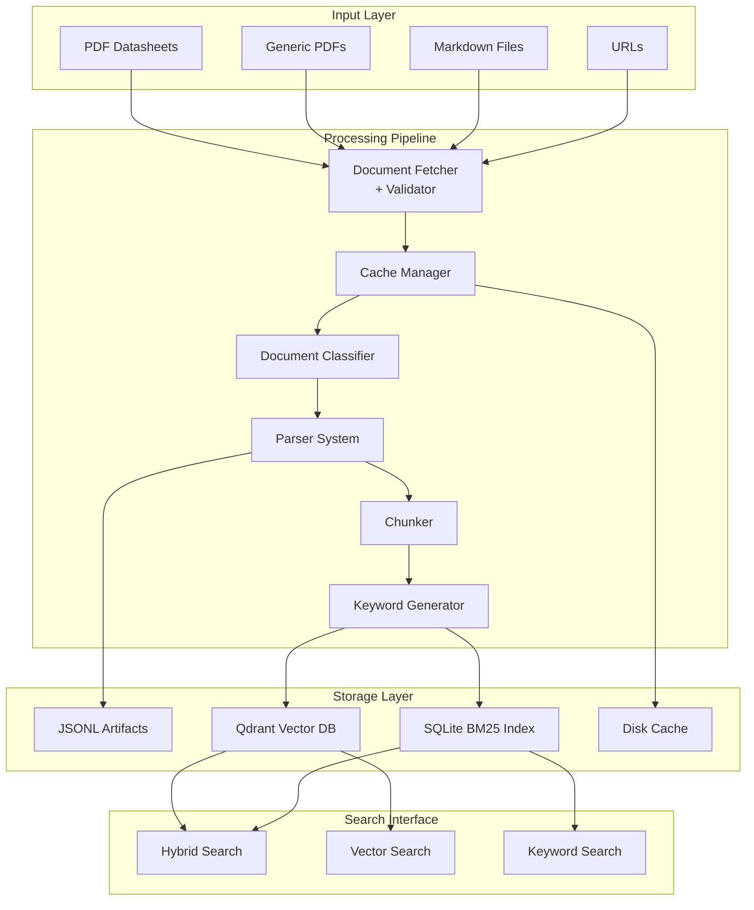

# 📚 Datasheet Ingestion Pipeline v2.1 - Complete Project Overview

## 🎯 Project Purpose

A production-ready ETL pipeline that ingests PDF datasheets and Markdown documents into a searchable vector database with hybrid search capabilities. The system extracts structured information (model/part numbers) from datasheets, chunks documents intelligently, and provides both semantic and keyword-based search.

## ✨ Key Features

- **Multi-format Support**: PDF datasheets, generic PDFs, and Markdown files
- **Intelligent Parsing**: 
  - Special datasheet parsing with model/part number extraction
  - Generic PDF parsing for regular documents
  - Direct Markdown ingestion without API calls
- **Hybrid Search**: Combines vector embeddings (semantic) with BM25 (keyword) search
- **Cost Optimization**: 
  - Disk-based caching to avoid redundant API calls
  - Batch API support for keyword generation
- **Production Ready**:
  - Comprehensive error handling and retries
  - Progress tracking and metrics
  - Structured logging
  - Input validation

## 🏗️ System Architecture



## 📁 Project Structure

```
datasheet-ingestion-pipeline/
├── datasheet_ingest_pipeline.py    # Main pipeline (enhanced)
├── pipeline_utils.py               # Validation, errors, retry logic
├── cache_manager.py                # LZ4-compressed disk cache
├── progress_monitor.py             # Progress tracking & metrics
├── keyword_index.py                # BM25 SQLite FTS5 index
├── hybrid_search.py                # Combined search implementation
├── search_cli.py                   # Search interface CLI
│
├── config.yaml                     # Configuration file
├── requirements.txt                # Python dependencies
├── pipeline.log                   # Structured logs
│
├── prompts/
│   └── datasheet_parse.txt        # Datasheet parsing prompt
│
├── cache/                         # Cached parsed documents
├── artefacts/                     # JSONL document storage
├── qdrant_data/                   # Vector embeddings
└── keyword_index.db               # BM25 search index
```

## 🔧 Module Descriptions

### 1. **Main Pipeline** (`datasheet_ingest_pipeline.py`)
Enhanced version of the original pipeline with:
- Three parsing modes: datasheet PDF, generic PDF, and Markdown
- Integrated caching, validation, and progress tracking
- Proper error handling with retries
- Batch processing support for keywords

**Key Classes:**
- `DocumentProcessor`: Orchestrates the pipeline
- `DocumentClassifier`: Determines parsing strategy
- `EmbeddingManager`: Handles vector embeddings
- `DatasheetArtefact`: Document metadata storage

### 2. **Pipeline Utilities** (`pipeline_utils.py`)
Common utilities and infrastructure:
- **Custom Exceptions**: `ValidationError`, `ParseError`, `NetworkError`
- **Validators**: URL and file validation
- **Retry Logic**: Decorator for API calls
- **Logging Setup**: Structured logging configuration

### 3. **Cache Manager** (`cache_manager.py`)
High-performance caching layer:
- LZ4 compression for space efficiency
- TTL-based expiration
- Cache statistics and hit rate tracking
- Simple disk-based storage

**Features:**
```python
cache = CacheManager(cache_dir="./cache", ttl_days=7, compress=True)
cached_doc = cache.get(doc_hash, prompt_hash)
cache.put(doc_hash, prompt_hash, document_data)
```

### 4. **Progress Monitor** (`progress_monitor.py`)
Comprehensive progress tracking:
- Per-document statistics
- Stage-based timing
- Global metrics collection
- JSON report generation
- Callback support for UI integration

**Metrics Tracked:**
- Documents processed/failed
- Processing time per stage
- Cache hit rates
- Chunk counts
- Error tracking

### 5. **Keyword Index** (`keyword_index.py`)
BM25 full-text search implementation:
- SQLite FTS5 backend for performance
- Part number search support
- Metadata preservation
- Index statistics

**Two Implementations:**
1. `BM25Index`: SQLite FTS5-based (recommended)
2. `SimpleBM25Index`: Pure Python fallback

### 6. **Hybrid Search** (`hybrid_search.py`)
Combines vector and keyword search:
- Configurable weighting (alpha parameter)
- Score normalization
- Result reranking
- Unified result format

### 7. **Search CLI** (`search_cli.py`)
User-friendly search interface:
- Three search modes: hybrid, vector, keyword
- Rich terminal output
- Configurable result limits
- Part number search support

## 🚀 Usage Examples

### Basic Ingestion
```bash
# Process PDF datasheets with keyword augmentation
python datasheet_ingest_pipeline.py --src *.pdf --with_keywords

# Process mixed document types
python datasheet_ingest_pipeline.py --src docs/*.pdf docs/*.md --mode auto

# Use custom configuration
python datasheet_ingest_pipeline.py --src @urls.txt --config production.yaml
```

### Cache Management
```bash
# View cache statistics
python -c "from cache_manager import CacheManager; print(CacheManager().get_stats())"

# Clear old cache entries
python -c "from cache_manager import CacheManager; CacheManager().clear(older_than_days=30)"
```

### Search Operations
```bash
# Hybrid search (recommended)
python search_cli.py "PM10K laser sensor" --mode hybrid --limit 10

# Search by part number
python search_cli.py "2293937" --mode keyword

# Semantic search for concepts
python search_cli.py "high precision optical power measurement" --mode vector
```

### Progress Monitoring
```bash
# Pipeline automatically generates reports
cat pipeline_report.json | jq '.summary'

# View index statistics
python -c "from keyword_index import BM25Index; print(BM25Index().get_stats())"
```

## ⚙️ Configuration

### `config.yaml` Structure
```yaml
pipeline:
  max_concurrent: 5
  timeout_seconds: 300
  
validation:
  validate_urls: true
  validate_files: true
  
limits:
  max_file_size_mb: 100
  max_pages_per_pdf: 50
  
cache:
  enabled: true
  directory: "./cache"
  ttl_days: 7
  compress: true
  
batch:
  enabled: true
  threshold: 10
  
openai:
  vision_model: "gpt-4o"
  embedding_model: "text-embedding-3-small"
  keyword_model: "gpt-4o-mini"
  max_retries: 3
  
logging:
  level: "INFO"
  file: "pipeline.log"
  
search:
  hybrid_alpha: 0.7  # Weight for vector search
  result_limit: 10
```

## 📊 Data Flow

### 1. **Document Processing Flow**
```
Input → Fetch → Validate → Cache Check → Parse → Chunk → Keywords → Embed → Index
```

### 2. **Parsing Strategy**
- **Markdown**: Direct read, no API call
- **Datasheet PDF**: Vision API with structured extraction prompt
- **Generic PDF**: Vision API with simple extraction prompt

### 3. **Storage Layers**
- **Artifacts**: JSONL files with parsed content and metadata
- **Cache**: LZ4-compressed parsed documents
- **Qdrant**: Vector embeddings for semantic search
- **SQLite**: FTS5 index for keyword search

## 🔐 API Keys Required

```bash
export OPENAI_API_KEY="sk-..."
```

## 📦 Installation

```bash
# Clone repository
git clone <repository-url>
cd datasheet-ingestion-pipeline

# Install dependencies
pip install -r requirements.txt

# Install Poppler (for PDF processing)
# macOS
brew install poppler
# Ubuntu
sudo apt-get install poppler-utils
```

### Requirements
```txt
openai>=1.0.0
pdf2image>=1.16.0
pillow>=10.0.0
llama-index>=0.9.0
qdrant-client>=1.7.0
tqdm>=4.65.0
aiohttp>=3.8.0
pyyaml>=6.0
lz4>=4.3.0
numpy>=1.24.0
rich>=13.0.0
tenacity>=8.2.0
```

## 🎯 Performance Characteristics

- **Processing Speed**: 1-3 documents/minute (depending on size)
- **Cache Hit Rate**: 50-90% on re-runs
- **Storage Overhead**: ~2-3x original document size
- **Search Latency**: <100ms for hybrid search
- **Batch Processing**: 50% cost reduction for keywords

## 🔄 Future Enhancements

1. **Web UI**: FastAPI-based interface
2. **Distributed Processing**: Multi-worker support
3. **Additional Formats**: DOCX, HTML support
4. **Advanced Search**: Faceted search, filters
5. **Monitoring**: Prometheus metrics, Grafana dashboards

## 📝 License

[Specify your license here]

---

This pipeline provides a robust, production-ready solution for ingesting and searching technical documents with state-of-the-art retrieval capabilities.